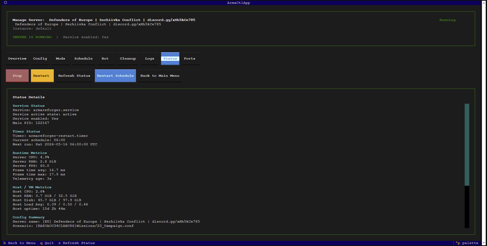

# armactl

[](https://github.com/dturovskiy/armactl/actions/workflows/ci.yml)
[](https://github.com/dturovskiy/armactl/releases)
[](LICENSE)
[](pyproject.toml)
[](README.md)

`armactl` is a free, local-first manager for **Arma Reforger Dedicated Server** on Ubuntu. It installs and repairs a server, manages `systemd`, edits `config.json`, works with mods and schedules, exposes optional Telegram controls, and includes a local browser dashboard.

The local web dashboard is included and is being hardened for production use. CLI, TUI, and the optional Telegram bot remain reliable fallback management paths.

## Screenshot



## Who This Is For

- Ubuntu 24.04 hosts
- one dedicated server instance per Linux user
- operators who want a repo-local launcher instead of global package setup
- operators who manage the server over SSH and want an optional local web dashboard

## Quick Start

```bash
git clone https://github.com/dturovskiy/armactl.git
cd armactl
./armactl
```

On first run, `./armactl` bootstraps the repo-local environment and opens the TUI. After that, keep using the same launcher: no PATH changes and no manual virtualenv activation are required.

To set up the browser dashboard on a server host:

```bash
./armactl web
```

The web setup flow installs web dependencies, creates the first owner when needed, writes runtime config, installs and starts `armactl-web.service`, and prints the URL/status summary. The safe default bind is local. Use LAN access only when the network and firewall setup are ready.

For the development toolchain from first launch:

```bash
ARMACTL_BOOTSTRAP_MODE=--dev ./armactl
```

## Core Scenarios

### Fresh Host

Use `./armactl` on a clean Ubuntu host and choose `Install New Server`. `armactl` installs SteamCMD if needed, downloads the server, creates config and runtime directories, generates `systemd` units, and starts the service.

### Existing Server

Use `Detect Existing Server` or `Manage Existing Server`. `armactl` checks the runtime root, `config.json`, service files, timer, and ports, then switches into management mode without reinstalling the server.

### Broken Install / Repair

Use `Repair Installation` in the TUI or:

```bash
armactl repair
```

Repair validates and regenerates missing pieces, refreshes service/timer files, reinstalls the secure helper when needed, and updates `state.json`.

## What armactl Does

- installs a server from scratch with SteamCMD
- detects and manages an existing installation
- starts, stops, restarts, and inspects the server
- edits `config.json` through TUI flows
- manages mods: add, remove, dedupe, import, export
- manages scheduled restarts through `systemd`
- exposes optional Telegram bot controls
- runs a local browser dashboard for server management
- shows real Arma Reforger server FPS/frame-time telemetry when `-logStats` data is available
- keeps runtime data separated from repo code

## Scheduled Restarts

In the TUI, `Restart Schedule` accepts exact times instead of raw `systemd` syntax:

```text
08:00
08:00, 20:00
08:00 20:00
```

`armactl` converts those values into the correct `OnCalendar=` entries.

## Server FPS Telemetry

Generated services start the server with:

```text
-logStats 10000
```

The server writes periodic engine telemetry into the runtime console log, and `armactl` reads the latest valid `FPS:` line from:

```text
~/armactl-data/<instance>/config/logs/*/console.log
```

Example:

```text
Server FPS:  60.0
Frame time:  16.7 ms avg / 18.5 ms max
Telemetry:   4s old
```

This value is the server engine's own FPS telemetry. It is not estimated from CPU usage.

## Runtime Layout

`armactl` separates source code, game runtime data, web runtime data, and logs:

| Layer | Location | Purpose |
|-------|----------|---------|
| Source code | this repository | CLI, TUI, web package, and backend modules |
| Runtime data | `~/armactl-data/default/` | server files, config, backups, state |
| Web runtime | `~/armactl-data/web/` | dashboard settings, users, sessions, jobs, and pending-work DB |
| Player registry | `~/armactl-data/<instance>/players.db` | instance-scoped player registry foundation |
| armactl logs | `~/armactl-data/logs/` | armactl-owned logs and web action records |
| System services | `/etc/systemd/system/` | auto-start and scheduled restarts |

Typical runtime structure:

```text
~/armactl-data/default/
├── server/
├── config/config.json
├── backups/
├── state.json
└── start-armareforger.sh
```

## Telegram Bot

Telegram bot management is optional and runs as a separate `systemd` unit:

- `armactl-bot.service`
- TUI settings screen: `Manage Existing Server -> Telegram Bot`
- instance-scoped `.env` as the single source of truth for bot settings

Runtime config path:

```text
~/armactl-data/<instance>/bot/.env
```

The repository ships [.env.example](.env.example) as a template. Real runtime `.env` files stay out of git.

See [docs/telegram-bot.md](docs/telegram-bot.md) for the full flow.

Read-only Discord community statistics can be published through a Discord webhook without exposing server-control commands:

```bash
./armactl stats discord configure --webhook-url "https://discord.com/api/webhooks/..." --enabled --interval-seconds 30
./armactl stats discord preview
./armactl stats discord publish
./armactl stats discord run
```

The publisher creates one Discord message, stores its message ID in the private instance bot config, and updates that message on later runs.

## Local Web Dashboard

The web dashboard runs beside the Arma server and reuses the same backend modules as the CLI and TUI. Current dashboard capabilities include:

- authenticated dashboard with live status polling
- safe config editing for selected non-secret fields plus a guarded redacted `config.json` editor
- mods management with add/remove, enable/disable, bulk paste, import/export, dedupe, and unused-addon cleanup checks
- game-admin management foundations
- restart schedule and game-service autostart controls with browser-local input plus UTC display
- file browser with bounded preview, single-file download, and no-overwrite upload
- logs and diagnostic report views
- server maintenance jobs for install, repair, update checks, and updates, with operator-visible job status for `/updates`, `server:update-check`, and `server:update` flows
- read-only public statistics output for community channels, without server-control commands
- instance-scoped player registry foundation with reliable IDs and no IP storage by default
- sessions, CSRF protection, permissions, and login throttling
- action records plus pending operator work for saved config/admin/mod changes

The public marketing website lives in the separate [`dturovskiy/armactl-website`](https://github.com/dturovskiy/armactl-website) repository. It is not the authenticated management dashboard.

## Documentation

- [Architecture](docs/architecture.md)
- [Development](docs/development.md)
- [Localization](docs/localization.md)
- [Telegram Bot](docs/telegram-bot.md)
- [Troubleshooting](docs/troubleshooting.md)
- [Web Dashboard](docs/web-interface-plan.md)
- [Web Deployment](docs/web-deployment.md)
- [Release Process](docs/release-process.md)
- [Roadmap](docs/roadmap.md)
- [Checklist](docs/checklist.md)

## CLI Commands

```text
armactl detect
armactl install
armactl repair

armactl start
armactl stop
armactl restart
armactl status
armactl logs
armactl ports

armactl config show
armactl config validate

armactl mods list
armactl mods add
armactl mods remove
armactl mods dedupe
armactl mods export FILE
armactl mods import FILE

armactl schedule show
armactl schedule set
armactl schedule enable
armactl schedule disable
```

## Development

```bash
./scripts/run-host-tests
.venv/bin/pytest
.venv/bin/ruff check src tests
```

If the repo was only bootstrapped in prod mode before, both `./armactl` and `./scripts/run-host-tests` refresh the repo-local `.venv` automatically after dependency changes.

## Project Health

- [Contributing](CONTRIBUTING.md)
- [Code of Conduct](CODE_OF_CONDUCT.md)
- [Security Policy](SECURITY.md)
- [Support](SUPPORT.md)
- [Changelog](CHANGELOG.md)

## License

MIT
